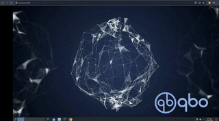

# QBO Plasma Web Desktop


<a href="https://www.youtube.com/watch?v=FNsvCnnOE1k" target="_blank">
 
</a>

A systemd Docker container based on the [Kind](https://kind.sigs.k8s.io/docs/design/base-image/) base image, capable of using NVIDIA GPUs on the host for CUDA development, gaming, VFX, and more.

It can we deployed locally or in [QBO Cloud](https://qbo.io/#/).

The container has been configured with the following components:

* [Plasma](https://github.com/KDE/plasma-desktop) + [Compiz](https://github.com/compiz-reloaded/compiz)
* [selkies-gstreamer](https://github.com/selkies-project/selkies-gstreamer)
* [WebRTC](https://webrtc.org/)
* [Coturn](https://github.com/coturn/coturn)
* [NGINX](http://hg.nginx.org/nginx)
* [Xvfb](https://www.x.org/releases/X11R7.6/doc/man/man1/Xvfb.1.xhtml)


## Requirements

### 1. Linux 
> Tested on: Fedora 40, Debian 12, and Ubuntu 24.04

### 2. NVIDIA GPU 
> Tested on: Tesla V100, Quadro T1000 and Quadro T2000 

### 3. [NVIDIA Drivers](https://www.nvidia.com/download/index.aspx) 

```bash
nvidia-smi 
```
```bash

Thu Aug  1 00:11:00 2024       
+-----------------------------------------------------------------------------------------+
| NVIDIA-SMI 555.58.02              Driver Version: 555.58.02      CUDA Version: 12.5     |
|-----------------------------------------+------------------------+----------------------+
| GPU  Name                 Persistence-M | Bus-Id          Disp.A | Volatile Uncorr. ECC |
| Fan  Temp   Perf          Pwr:Usage/Cap |           Memory-Usage | GPU-Util  Compute M. |
|                                         |                        |               MIG M. |
|=========================================+========================+======================|
|   0  Quadro T1000                   Off |   00000000:01:00.0 Off |                  N/A |
| N/A   65C    P0             14W /   50W |     128MiB /   4096MiB |      6%      Default |
|                                         |                        |                  N/A |
+-----------------------------------------+------------------------+----------------------+
                                                                                         
+-----------------------------------------------------------------------------------------+
| Processes:                                                                              |
|  GPU   GI   CI        PID   Type   Process name                              GPU Memory |
|        ID   ID                                                               Usage      |
|=========================================================================================|
|    0   N/A  N/A      2581      G   /usr/libexec/Xorg                               4MiB |
|    0   N/A  N/A   3131712      C   /usr/bin/python3                              119MiB |
+-----------------------------------------------------------------------------------------+

```
  
### 4. [Container Toolkit](https://docs.nvidia.com/datacenter/cloud-native/container-toolkit/latest/install-guide.html)

### 5. Docker 

> Tested on Docker version 24.0.5

### 6. DOcker NVIDIA Runtime

> Docker Runtime Configuration
```bash
cat /etc/docker/daemon.json 
```
```json
{
    "runtimes": {
        "nvidia": {
            "args": [],
            "path": "nvidia-container-runtime"
        }
    }
}
```

> Get Docker Runtime Configuration
```bash
 docker info | grep nvidia
```
```bash
 Runtimes: io.containerd.runc.v2 nvidia runc
```


## Get Started

```bash
git clone https://github.com/alexeadem/plasma.git
```
```bash
cd plasma 
```

```bash
./qbo start plasma 
```
```bash
CUDA_VERSION = 12.5
NVIDIA_DRIVER_VERSION = 555.58.02
prod
>>> docker run --name plasma -p8080:8080 --tmpfs /dev/shm:rw --ulimit nofile=65536:65536 -e SELKIES_ENABLE_BASIC_AUTH=true -e PASSWD=960 -e DISPLAY=:5 -e CUDA_VERSION=12.5 -e NVIDIA_DRIVER_VERSION=555.58.02 --gpus all --privileged -v /lib/modules:/lib/modules:ro -it 40bf6bb291c4
INFO: ensuring we can execute mount/umount even with userns-remap
INFO: remounting /sys read-only
INFO: making mounts shared
INFO: detected cgroup v2
INFO: clearing and regenerating /etc/machine-id
Initializing machine ID from D-Bus machine ID.
INFO: faking /sys/class/dmi/id/product_name to be "kind"
INFO: faking /sys/class/dmi/id/product_uuid to be random
INFO: faking /sys/devices/virtual/dmi/id/product_uuid as well
INFO: setting iptables to detected mode: legacy
INFO: detected IPv4 address: 172.17.0.7
INFO: detected IPv6 address: 
INFO: starting init
systemd 252.26-1~deb12u2 running in system mode (+PAM +AUDIT +SELINUX +APPARMOR +IMA +SMACK +SECCOMP +GCRYPT -GNUTLS +OPENSSL +ACL +BLKID +CURL +ELFUTILS +FIDO2 +IDN2 -IDN +IPTC +KMOD +LIBCRYPTSETUP +LIBFDISK +PCRE2 -PWQUALITY +P11KIT +QRENCODE +TPM2 +BZIP2 +LZ4 +XZ +ZLIB +ZSTD -BPF_FRAMEWORK -XKBCOMMON +UTMP +SYSVINIT default-hierarchy=unified)
Detected virtualization docker.
Detected architecture x86-64.

Welcome to Debian GNU/Linux 12 (bookworm)!

Queued start job for default target graphical.target.
[  OK  ] Created slice system-modprobe.slice - Slice /system/modprobe.
[  OK  ] Created slice user.slice - User and Session Slice.
[  OK  ] Started systemd-ask-password-console.path - Dispatch Password Requests to Console Directory Watch.
[  OK  ] Started systemd-ask-password-wall.path - Forward Password Requests to Wall Directory Watch.
[  OK  ] Set up automount proc-sys-fs-binfmt_misc.automount - Arbitrary Executable File Formats File System Automount Point.
[  OK  ] Reached target cryptsetup.target - Local Encrypted Volumes.
[  OK  ] Reached target integritysetup.target - Local Integrity Protected Volumes.
[  OK  ] Reached target network-online.target - Network is Online.
[  OK  ] Reached target nss-user-lookup.target - User and Group Name Lookups.
[  OK  ] Reached target slices.target - Slice Units.
[  OK  ] Reached target swap.target - Swaps.
[  OK  ] Reached target veritysetup.target - Local Verity Protected Volumes.
[  OK  ] Listening on systemd-initctl.socket - initctl Compatibility Named Pipe.
[  OK  ] Listening on systemd-journald-audit.socket - Journal Audit Socket.
[  OK  ] Listening on systemd-journald-dev-log.socket - Journal Socket (/dev/log).
[  OK  ] Listening on systemd-journald.socket - Journal Socket.
         Mounting dev-hugepages.mount - Huge Pages File System...
         Mounting sys-kernel-debug.mount - Kernel Debug File System...
         Mounting sys-kernel-tracing.mount - Kernel Trace File System...
         Starting kmod-static-nodes.service - Create List of Static Device Nodes...
         Starting modprobe@configfs.service - Load Kernel Module configfs...
         Starting modprobe@dm_mod.service - Load Kernel Module dm_mod...
         Starting modprobe@drm.service - Load Kernel Module drm...
         Starting modprobe@fuse.service - Load Kernel Module fuse...
         Starting modprobe@loop.service - Load Kernel Module loop...
         Starting systemd-journald.service - Journal Service...
         Starting systemd-modules-load.service - Load Kernel Modules...
         Starting systemd-remount-fs.service - Remount Root and Kernel File Systems...
[  OK  ] Mounted dev-hugepages.mount - Huge Pages File System.
[  OK  ] Mounted sys-kernel-debug.mount - Kernel Debug File System.
[  OK  ] Mounted sys-kernel-tracing.mount - Kernel Trace File System.
[  OK  ] Finished kmod-static-nodes.service - Create List of Static Device Nodes.
modprobe@configfs.service: Deactivated successfully.
[  OK  ] Finished modprobe@configfs.service - Load Kernel Module configfs.
modprobe@dm_mod.service: Deactivated successfully.
[  OK  ] Finished modprobe@dm_mod.service - Load Kernel Module dm_mod.
modprobe@drm.service: Deactivated successfully.
[  OK  ] Finished modprobe@drm.service - Load Kernel Module drm.
modprobe@fuse.service: Deactivated successfully.
[  OK  ] Finished modprobe@fuse.service - Load Kernel Module fuse.
modprobe@loop.service: Deactivated successfully.
[  OK  ] Finished modprobe@loop.service - Load Kernel Module loop.
         Mounting sys-fs-fuse-connections.mount - FUSE Control File System...
         Mounting sys-kernel-config.mount - Kernel Configuration File System...
[  OK  ] Finished systemd-modules-load.service - Load Kernel Modules.
[  OK  ] Finished systemd-remount-fs.service - Remount Root and Kernel File Systems.
[  OK  ] Mounted sys-fs-fuse-connections.mount - FUSE Control File System.
[  OK  ] Mounted sys-kernel-config.mount - Kernel Configuration File System.
         Starting systemd-sysctl.service - Apply Kernel Variables...
         Starting systemd-sysusers.service - Create System Users...
[  OK  ] Started systemd-journald.service - Journal Service.
         Starting systemd-journal-flush.service - Flush Journal to Persistent Storage...
[  OK  ] Finished systemd-sysctl.service - Apply Kernel Variables.
[  OK  ] Finished systemd-sysusers.service - Create System Users.
         Starting systemd-tmpfiles-setup-dev.service - Create Static Device Nodes in /dev...
[  OK  ] Finished systemd-journal-flush.service - Flush Journal to Persistent Storage.
[  OK  ] Finished systemd-tmpfiles-setup-dev.service - Create Static Device Nodes in /dev.
[  OK  ] Reached target local-fs-pre.target - Preparation for Local File Systems.
[  OK  ] Reached target local-fs.target - Local File Systems.
         Starting systemd-tmpfiles-setup.service - Create Volatile Files and Directories...
[  OK  ] Finished systemd-tmpfiles-setup.service - Create Volatile Files and Directories.
[  OK  ] Started haveged.service - Entropy Daemon based on the HAVEGE algorithm.
         Starting systemd-update-utmp.service - Record System Boot/Shutdown in UTMP...
[  OK  ] Finished systemd-update-utmp.service - Record System Boot/Shutdown in UTMP.
[  OK  ] Reached target sysinit.target - System Initialization.
[  OK  ] Started cups.path - CUPS Scheduler.
[  OK  ] Started man-db.timer - Daily man-db regeneration.
[  OK  ] Started systemd-tmpfiles-clean.timer - Daily Cleanup of Temporary Directories.
[  OK  ] Reached target paths.target - Path Units.
[  OK  ] Reached target timers.target - Timer Units.
[  OK  ] Listening on avahi-daemon.socket - Avahi mDNS/DNS-SD Stack Activation Socket.
[  OK  ] Listening on cups.socket - CUPS Scheduler.
[  OK  ] Listening on dbus.socket - D-Bus System Message Bus Socket.
[  OK  ] Reached target sockets.target - Socket Units.
[  OK  ] Reached target basic.target - Basic System.
         Starting accounts-daemon.service - Accounts Service...
         Starting avahi-daemon.service - Avahi mDNS/DNS-SD Stack...
         Starting containerd.service - containerd container runtime...
[  OK  ] Started cron.service - Regular background program processing daemon.
         Starting cups.service - CUPS Scheduler...
         Starting dbus.service - D-Bus System Message Bus...
         Starting enable-linger.service - Enable lingering for username...
         Starting ssh.service - OpenBSD Secure Shell server...
         Starting systemd-logind.service - User Login Management...
         Starting systemd-user-sessions.service - Permit User Sessions...
         Starting udisks2.service - Disk Manager...
         Starting xvfb.service - X Virtual Frame Buffer Service...
[  OK  ] Started dbus.service - D-Bus System Message Bus.
[  OK  ] Started cups.service - CUPS Scheduler.
[  OK  ] Finished systemd-user-sessions.service - Permit User Sessions.
[  OK  ] Started avahi-daemon.service - Avahi mDNS/DNS-SD Stack.
[  OK  ] Started console-getty.service - Console Getty.
[  OK  ] Reached target getty.target - Login Prompts.
[  OK  ] Started cups-browsed.service - Make remote CUPS printers available locally.
         Starting modprobe@drm.service - Load Kernel Module drm...
[  OK  ] Finished modprobe@drm.service - Load Kernel Module drm.
         Starting polkit.service - Authorization Manager...
[  OK  ] Started ssh.service - OpenBSD Secure Shell server.
[  OK  ] Started polkit.service - Authorization Manager.
[  OK  ] Started udisks2.service - Disk Manager.
[  OK  ] Started containerd.service - containerd container runtime.
[  OK  ] Started systemd-logind.service - User Login Management.
[  OK  ] Created slice user-1000.slice - User Slice of UID 1000.
         Starting user-runtime-dir@1000.service - User Runtime Directory /run/user/1000...
[  OK  ] Finished enable-linger.service - Enable lingering for username.
[  OK  ] Started accounts-daemon.service - Accounts Service.
[  OK  ] Started selkies.service - Selkies Service.
         Starting nginx.service - A high performance web server and a reverse proxy server...
[  OK  ] Finished user-runtime-dir@1000.service - User Runtime Directory /run/user/1000.
         Starting user@1000.service - User Manager for UID 1000...
[  OK  ] Started user@1000.service - User Manager for UID 1000.
[  OK  ] Started xvfb.service - X Virtual Frame Buffer Service.
         Starting plasma.service - Plama Service...
         Starting packagekit.service - PackageKit Daemon...
[  OK  ] Started packagekit.service - PackageKit Daemon.
[  OK  ] Started nginx.service - A high performance web server and a reverse proxy server.
[  OK  ] Reached target multi-user.target - Multi-User System.

Debian GNU/Linux 12 34f258f0cedd console

34f258f0cedd login:
```

# Accessing the Desktop
> Open your web browser.
> Navigate to: http://localhost:8080

# Credentials 
> Username: qbo
> 
> Password: 960


# Features
* Plama + Compiz
* NVIDIA Cuda Tookit 12.5
* NVIDIA NSight Compute
* NVIDIA NSight Systems
* NVIDIA Visual Profler
* Visual Studio Code
* Chrome
* VLC
* Extreme Tux Racer


